# OS-Pulse System Diagrams for Thesis

This document contains comprehensive system diagrams for the OS-Pulse monitoring platform, designed for inclusion in academic thesis documentation. All diagrams use consistent styling and are optimized for A4 page printing.

## 1. System Architecture Overview

**Description:** This diagram presents the high-level architecture of the OS-Pulse system, showing the six main layers and their communication protocols. The architecture follows a multi-tier pattern with clear separation of concerns: the Client Layer (web browser) communicates with the Frontend Layer (React application) via HTTP, which connects to the Backend Layer (Go API server) through REST APIs. The Backend interfaces with PostgreSQL for data persistence and coordinates with the Agent Layer for system monitoring. The Agent Layer instruments the Target System using Frida's dynamic instrumentation capabilities. This architecture ensures modularity, scalability, and separation between monitoring logic and data storage.

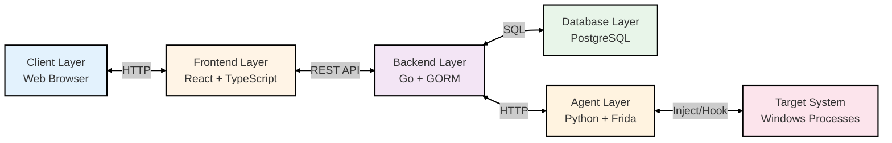

## 1.1 Frontend Architecture

**Description:** The Frontend Architecture diagram details the React-based web application structure. Built with modern web technologies including Vite as the development server, the frontend consists of multiple UI components (Dashboard, Event Tables, Process List, File Upload, and noVNC Viewer) that provide the user interface. State management is handled through React Hooks and Context API, ensuring efficient data flow and component communication. Styling is implemented using Tailwind CSS for responsive and consistent design. This architecture enables real-time event visualization and interactive monitoring controls while maintaining clean separation between presentation, state, and styling concerns.

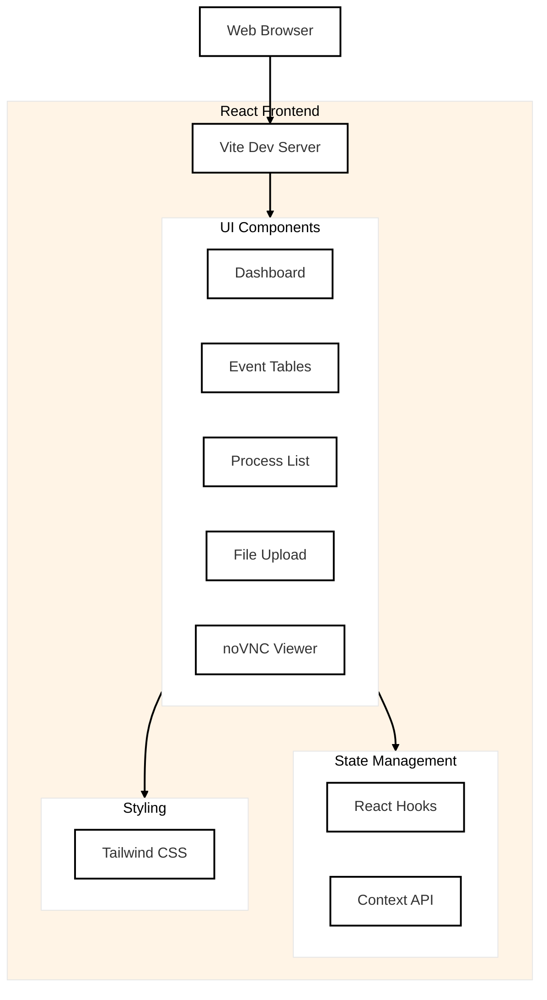

## 1.2 Backend Architecture (Layered)

**Description:** This diagram illustrates the layered architecture of the Go backend, following clean architecture principles. The Echo Framework serves as the API server foundation, routing requests to the Handler Layer (FrontendHandler and EventHandler). Handlers delegate business logic to the Service Layer (SessionService and EventService), which coordinates operations across different concerns. The Repository Layer (SessionRepository and EventRepository) provides data access abstraction, interfacing with GORM ORM for database operations. This layered approach ensures testability, maintainability, and clear separation of concerns, with each layer having well-defined responsibilities and dependencies flowing in one direction.

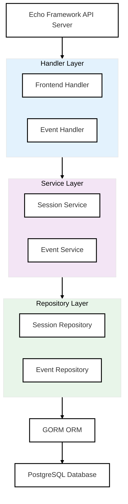

## 1.3 Agent System Architecture

**Description:** The Agent System Architecture shows the complex monitoring infrastructure responsible for capturing system events. A Flask API Server provides the HTTP interface for backend communication. The Controller Component (Python) includes the Frida Controller for session management, Message Handler for event processing, and API Client for backend communication. The Injector Component (TypeScript) contains the actual Frida Agent Script with specialized monitors for file operations, process creation, and event transmission. Network Monitors operate independently, with HTTP Interceptor (mitmproxy) capturing web traffic and Network Interceptor (tshark) analyzing raw packets. All components coordinate through the Frida Framework to instrument target processes and forward events to the backend API.

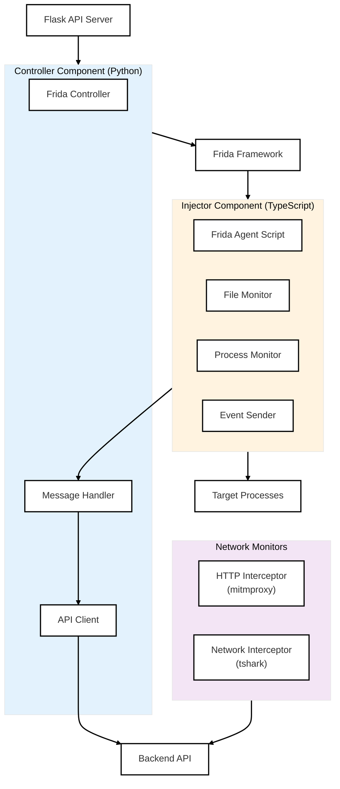

## 1.4 Data Flow Architecture

**Description:** This diagram traces the complete data flow from event generation to user visualization. Event Sources (file operations, process creation, HTTP traffic, network packets) are captured by specialized Collection components (Frida Agent, HTTP Interceptor, Network Interceptor). The Processing layer includes a Message Handler that queues events and a Batch Processor that optimizes transmission. Events flow to the Storage layer where the Backend API persists them in PostgreSQL using JSONB format for flexible schema. Finally, the Display layer retrieves events through the React Dashboard and presents them in Event Tables for real-time analysis. This flow demonstrates the system's ability to handle high-volume event streams with efficient batching and storage strategies.

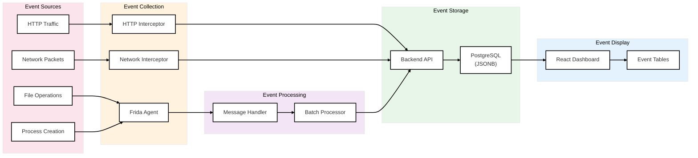

## 1.5 Deployment Architecture

**Description:** The Deployment Architecture presents the physical organization of system components across development and target environments. Within the Development Machine, four containers run independently: Frontend (Vite Dev Server with React Application), Backend (Go API Server), Agent (Flask Server with Frida Service), and Database (PostgreSQL in Docker). The Target Environment represents monitored systems where target processes interact with Windows APIs. This separation ensures that monitoring infrastructure operates independently from monitored systems, enabling secure analysis of potentially malicious software without compromising the monitoring platform. The architecture supports both local development and production deployment scenarios.

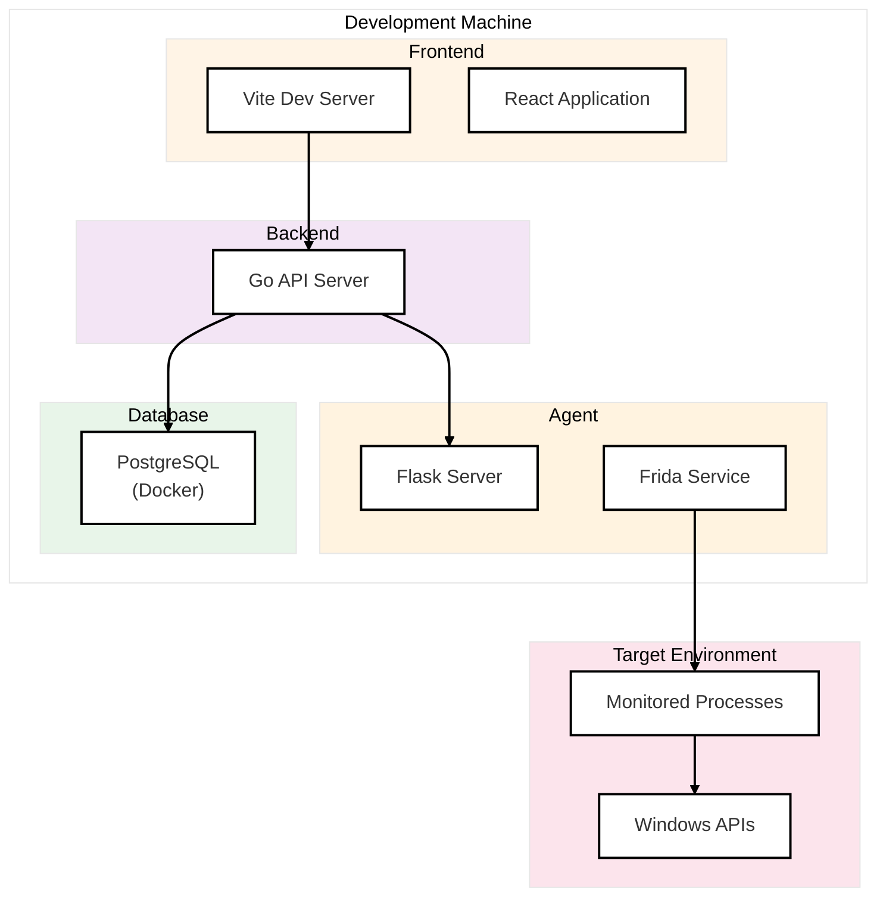

## 2. Database Schema with Relationships

**Description:** This Entity-Relationship Diagram depicts the PostgreSQL database schema with all tables and their relationships. The SESSIONS table stores monitoring session metadata (file name, path, status, timestamps) with a one-to-many relationship to the EVENTS table. The EVENTS table contains event metadata (type, timestamp, source) with a JSONB data column that can store any of four event data types: FILE_OPERATION (file I/O details), PROCESS_CREATION (process spawning information), HTTP_EVENT (web traffic data), and NETWORK_EVENT (raw packet information). The JSONB storage approach provides schema flexibility while maintaining relational integrity through foreign keys. The is_sent boolean flag supports batch retrieval patterns where the frontend marks events as delivered, preventing duplicate transmissions.

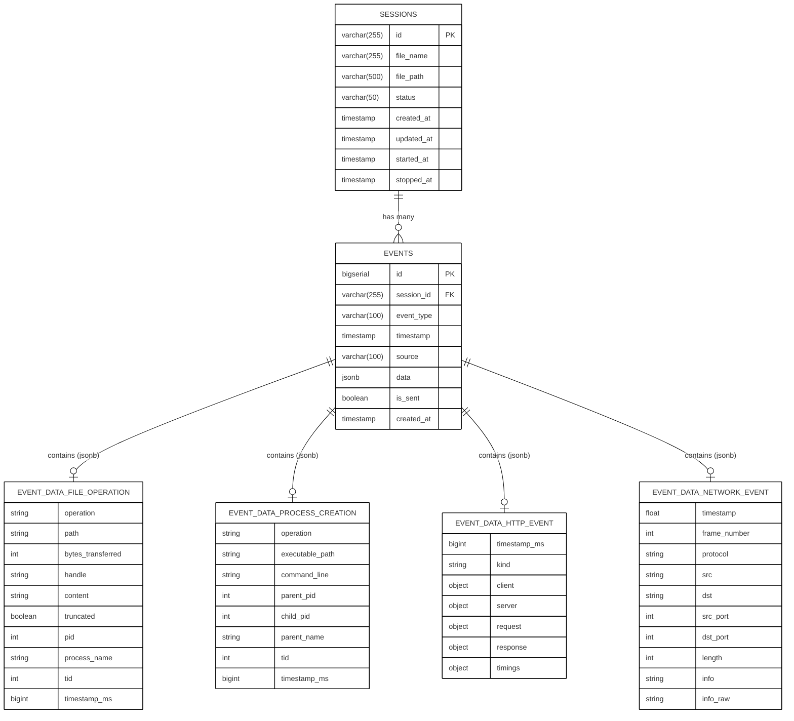

## 3. Use Case Diagrams

These diagrams illustrate the functional requirements and user interactions within the OS-Pulse system from different perspectives.

### 3.1 Core Monitoring Use Cases

**Description:** This diagram shows the primary workflow for security researchers and malware analysts. The core monitoring cycle begins with uploading a malware sample, which creates a monitoring session. Users then start monitoring to instrument the target process, view events in real-time as the malware executes, and eventually stop monitoring to conclude the session. Finally, users analyze the collected data to understand malware behavior. This workflow represents the fundamental use case that drives all system functionality, emphasizing the sequential nature of malware analysis tasks.

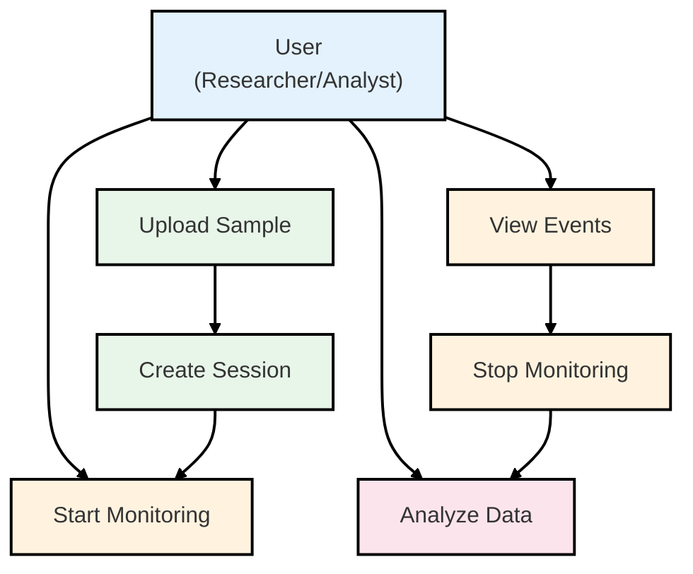

### 3.2 Monitoring Modes Use Cases

**Description:** This diagram details the three distinct monitoring modes available in OS-Pulse. Mode 1 (Monitor All Processes) attaches to every running process system-wide, suitable for comprehensive system-level analysis. Mode 2 (Monitor Specific Process) targets individual processes by PID, ideal for focused investigation of known suspicious processes. Mode 3 (Spawn and Monitor) launches an uploaded executable in a controlled environment with immediate instrumentation, perfect for analyzing malware samples safely. These modes provide flexibility for different analysis scenarios, from broad system monitoring to isolated malware execution.

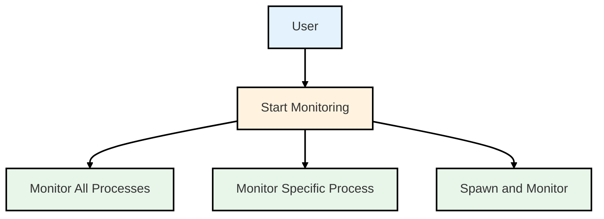

### 3.3 Event Capture Use Cases

**Description:** This diagram illustrates the four primary event capture capabilities once monitoring is active. The system simultaneously captures file operations (read/write activity), tracks process creation (new process spawning), intercepts HTTP traffic (web communications), and analyzes network packets (raw socket data). All captured events flow to the display subsystem for real-time visualization. This parallel event capture architecture ensures comprehensive visibility into malware behavior across file system, process, and network dimensions, enabling thorough behavioral analysis.

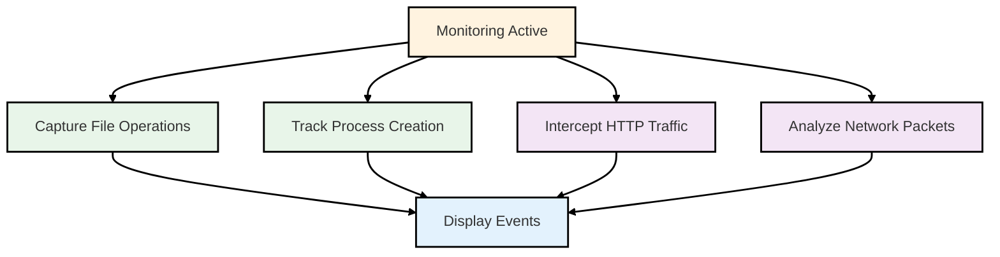

### 3.4 Administrative Use Cases

**Description:** This diagram presents administrative and analytical capabilities available to system administrators and advanced users. Administrators can view overall system status to monitor health and performance, manage sessions to organize analysis activities, configure system parameters for customized monitoring behavior, query events using advanced filters for targeted investigation, and view statistics for understanding system usage patterns. These capabilities support both operational management and research workflows, enabling users to maintain the system while conducting sophisticated malware analysis.

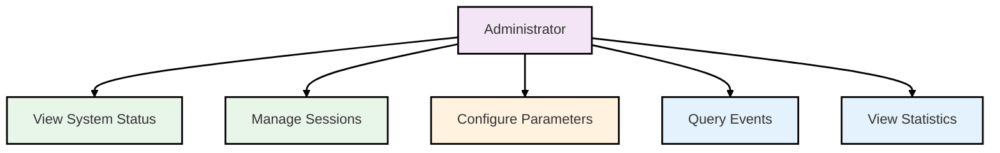

## 4. Class Diagrams

These diagrams provide detailed views of the object-oriented design, showing classes, attributes, methods, and relationships across different architectural layers.

### 4.1 Domain Models

**Description:** This diagram presents the core domain entities that represent the business logic of the OS-Pulse system. The Session class encapsulates monitoring session state with properties for file information, status tracking, and lifecycle timestamps, along with methods for session management (create, update, get, delete). The Event class represents individual monitoring events with type classification, timestamp, source identification, and JSONB data storage, providing methods for event creation, retrieval, and status marking. The one-to-many relationship (one Session has many Events) forms the foundation of the system's data model, enabling temporal correlation of events within analysis sessions.

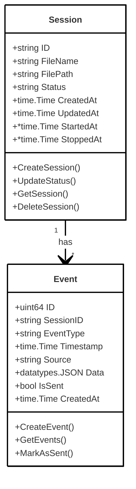

### 4.2 Backend Repository Layer

**Description:** This diagram shows the data access layer that abstracts database operations using the Repository pattern. SessionRepository manages CRUD operations for sessions, providing methods to create, retrieve, update, and delete sessions, plus list all sessions. EventRepository handles event persistence with more complex operations including event creation, retrieval of unsent events (for batch processing), time-range queries (for temporal analysis), pagination support, batch status updates, and statistics counting. Both repositories encapsulate GORM database access, shielding upper layers from database implementation details. The simplified Session and Event classes shown here represent the domain models these repositories manage.

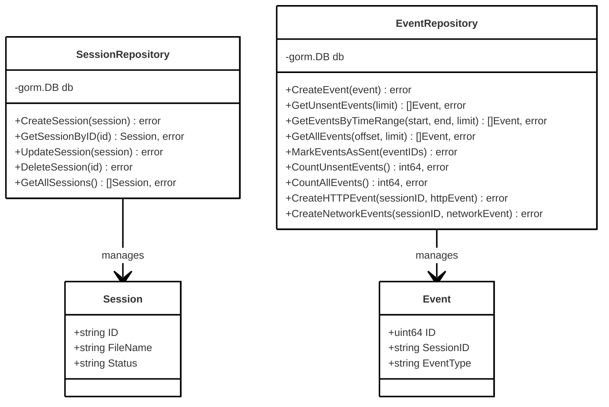

### 4.3 Backend Service Layer

**Description:** This diagram illustrates the business logic layer that orchestrates operations across repositories. SessionService coordinates session lifecycle management, including creation with file metadata, retrieval, status updates, explicit start/stop operations, and session listing. EventService manages event operations including creation, retrieval of unsent events for batch transmission, statistical aggregation for analytics, pagination for UI display, and specialized methods for HTTP and network events. Each service depends on its corresponding repository, implementing business rules and coordinating multiple repository calls when needed. This layer isolates business logic from both HTTP handling (above) and data access (below).

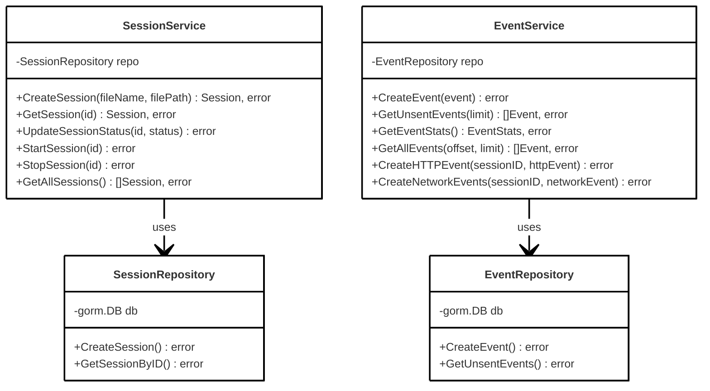

### 4.4 Backend Handler Layer

**Description:** This diagram presents the HTTP request handling layer that serves as the system's external interface. FrontendHandler manages all frontend-facing operations including session creation (with file upload), retrieving available monitoring modes, starting and stopping monitoring (coordinating with AgentClient), event retrieval for the dashboard, and process listing. EventHandler receives events from monitoring agents with three specialized endpoints for general events, HTTP traffic events, and network packet events. Handlers depend on services for business logic and AgentClient for forwarding requests to the agent system. This layer implements HTTP protocol concerns (request parsing, response formatting, error handling) while delegating domain logic to services.

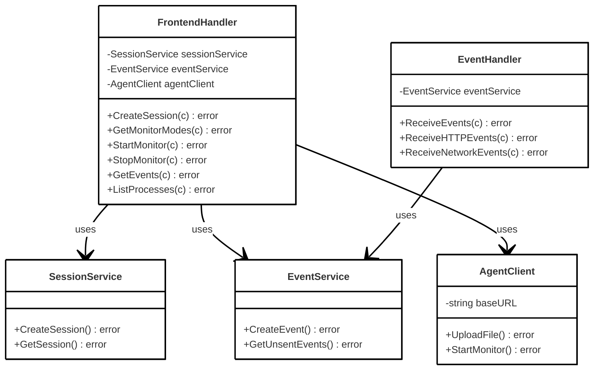

### 4.5 Agent System Classes

**Description:** This diagram depicts the agent-side architecture responsible for system instrumentation and monitoring. FridaController manages Frida sessions, providing methods to spawn new processes with monitoring, attach to existing processes (individual or system-wide), stop monitoring, and handle messages from injected agents. MessageHandler processes events from the Frida runtime, queuing them for batch transmission, forwarding to the backend via APIClient, and handling specialized event types (file operations, process creation). APIClient encapsulates HTTP communication with the backend, supporting single and batch event transmission, session information retrieval, and health checks. TypeScriptAgent represents the injected code running within target processes, with monitors for file operations and process creation, plus event sender functionality. The relationships show how FridaController injects TypeScriptAgent into targets, which then sends events through MessageHandler to APIClient for backend delivery.

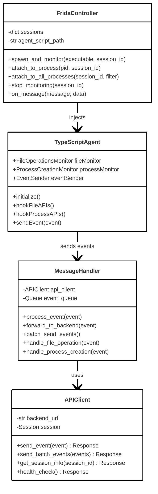

### 4.6 Network Monitor Classes

**Description:** This diagram shows the specialized network monitoring components that operate independently from the Frida-based monitoring. HTTPInterceptor (implemented using mitmproxy) captures HTTP/HTTPS traffic with methods to process requests and responses, convert flows to events, and post events to the backend asynchronously using a thread pool executor. NetworkInterceptor (implemented using tshark) captures raw network packets, parsing packet data into events and sending them in batches to reduce HTTP overhead. Both interceptors post directly to EventHandler endpoints in the backend, bypassing the agent controller. This architecture enables comprehensive network visibility alongside file and process monitoring, supporting analysis of malware network communications.

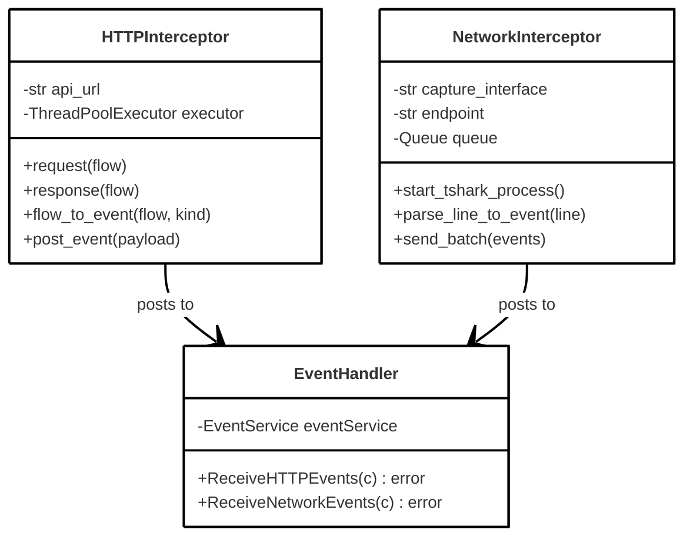

## 5. Sequence Diagrams - Monitoring Flow

These diagrams illustrate the dynamic behavior and interaction patterns between system components during key operations.

### 5.1 Session Creation & Monitoring Start

**Description:** This sequence diagram shows the complete workflow from uploading a malware sample to starting active monitoring. The user initiates file upload through the frontend, which sends a multipart form request to the backend. The backend creates a session record in the database (generating a unique session ID), forwards the file to the agent service, and returns the session ID to the frontend. When the user starts monitoring, the frontend sends a start monitor request to the backend, which updates the session status to "active" in the database and forwards the request to the agent. The agent spawns the target process and injects Frida hooks, confirming successful hook installation before notifying the backend of monitoring activation. This flow demonstrates the coordination required across all system layers to initiate secure malware monitoring.

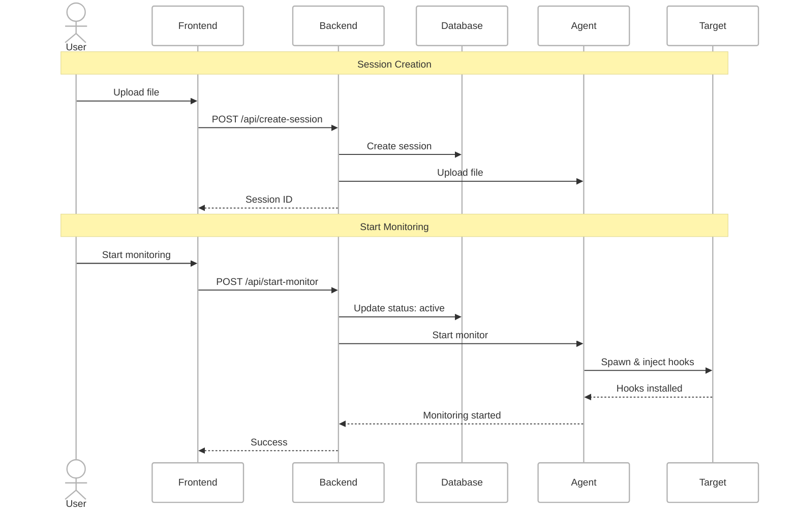

### 5.2 Event Capture & Storage

**Description:** This sequence diagram illustrates real-time event capture, storage, and retrieval during active monitoring. When the target process executes monitored APIs (ReadFile, CreateProcess), the injected agent's hooks trigger, capturing event data and sending it to the backend. The backend stores events in the database with is_sent=false, marking them as "unsent" for batch retrieval. The frontend periodically polls the backend for new events, which queries unsent events from the database, returns them to the frontend, and marks them as sent (is_sent=true) to prevent duplication. The frontend then displays these events in real-time tables. This flow shows the efficient batch-based retrieval pattern that reduces database load while providing near-real-time event visibility, crucial for analyzing fast-executing malware.

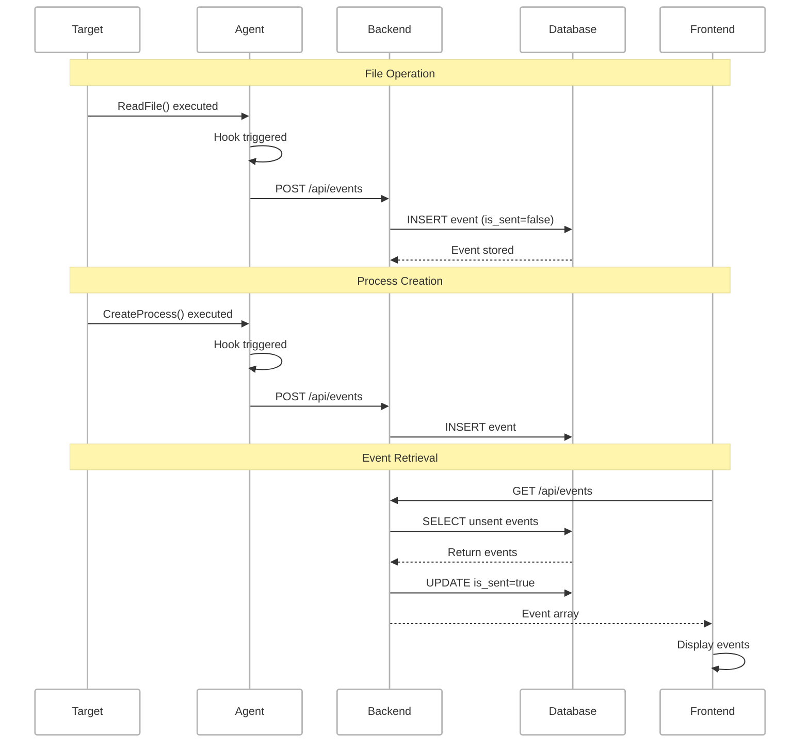

### 5.3 Stop Monitoring

**Description:** This sequence diagram depicts the graceful shutdown of monitoring operations. When the user stops monitoring through the frontend, the request flows to the backend which updates the session status to "stopped" in the database and forwards the stop request to the agent. The agent removes all API hooks from the target process and detaches Frida instrumentation cleanly, preventing crashes or detection. The agent confirms successful shutdown to the backend, which notifies the frontend. The frontend then displays final statistics (total events captured, session duration, etc.) to the user. This controlled shutdown ensures data integrity, allows proper cleanup of instrumentation, and provides users with summary information for their analysis session.

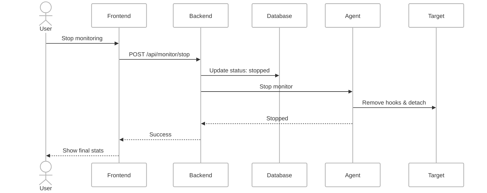

## 6. Sequence Diagram - Event Processing Detail

**Description:** This detailed sequence diagram examines the internal event processing pipeline within the agent system. When an API hook triggers in the injected agent, it creates a structured event object and sends it through the Frida runtime to the controller. The controller parses the message and passes it to the message handler for processing. The handler validates event structure, enriches it with session context and timestamps, and enqueues it in a batch queue. When the batch reaches a threshold (10 events) or timeout (1 second), the handler dequeues events and sends them as a batch to the backend via the API client. The backend processes each event in the batch, converting data to JSONB format using MarshalJSON and inserting records into the database with is_sent=false. On success, the API client clears sent events from memory. The diagram also shows error handling with automatic retry logic (up to 3 attempts with exponential backoff) for network failures, ensuring reliable event delivery even under unstable network conditions. This batching strategy significantly reduces HTTP overhead while maintaining low latency for event visibility.

```mermaid
---
config:
    theme: neo
    themeVariables:
        fontSize: 12px
---
sequenceDiagram
    participant Agent
    participant Controller
    participant Queue
    participant Backend
    participant Database
    
    Note over Agent,Database: Event Capture
    Agent->>Agent: API hook triggered
    Agent->>Controller: send(event)
    Controller->>Queue: enqueue(event)
    
    Note over Agent,Database: Batch Processing
    Queue->>Controller: Batch ready (10 events)
    Controller->>Backend: POST /api/events (batch)
    
    loop For each event
        Backend->>Database: INSERT INTO events
        Database-->>Backend: Event stored
    end
    
    Backend-->>Controller: Success
    Controller->>Queue: Clear sent events
    
    Note over Agent,Database: Error Handling
    Controller->>Backend: POST /api/events
    Backend--XController: Timeout
    Controller->>Controller: Retry (max 3)
    Controller->>Backend: POST /api/events
    Backend-->>Controller: Success
```

## 7. Life Cycle Model - Iterative Incremental Development

These diagrams illustrate the software development methodology used to build the OS-Pulse system, following an iterative incremental approach.

### 7.1 Development Iterations Overview

**Description:** This diagram presents the complete 15-week development timeline organized into five iterations, each building incrementally on previous work. The Planning Phase established requirements, architecture, and risk assessment. Iteration 1 (Weeks 1-3) delivered core infrastructure with basic monitoring capabilities and simple UI. Iteration 2 (Weeks 4-6) added comprehensive file and process monitoring with event storage. Iteration 3 (Weeks 7-9) integrated network monitoring capabilities through mitmproxy and tshark. Iteration 4 (Weeks 10-12) enhanced the dashboard with real-time updates, filtering, and statistics. Iteration 5 (Weeks 13-15) focused on optimization, error handling, and documentation. Each iteration produced working, deployable software, allowing early validation and risk mitigation. The final Deployment phase covers production setup, user training, and ongoing maintenance. This iterative approach enabled continuous feedback incorporation and adaptation to changing requirements throughout development.

```mermaid
---
config:
    theme: neo
    themeVariables:
        fontSize: 12px
---
flowchart TB
    subgraph Planning["Planning Phase"]
        P1["Requirements Gathering"]
        P2["Architecture Design"]
        P3["Risk Assessment"]
    end
    
    subgraph Iteration1["Iteration 1: Core Infrastructure<br/>(Weeks 1-3)"]
        I1["• PostgreSQL setup<br/>• Go backend skeleton<br/>• Basic Frida agent<br/>• Simple React UI"]
    end
    
    subgraph Iteration2["Iteration 2: Monitoring<br/>(Weeks 4-6)"]
        I2["• File operation hooks<br/>• Process creation hooks<br/>• Event storage<br/>• Event tables UI"]
    end
    
    subgraph Iteration3["Iteration 3: Network<br/>(Weeks 7-9)"]
        I3["• mitmproxy integration<br/>• tshark integration<br/>• Network event models<br/>• Network UI"]
    end
    
    subgraph Iteration4["Iteration 4: Dashboard<br/>(Weeks 10-12)"]
        I4["• Real-time polling<br/>• Advanced filters<br/>• Event statistics<br/>• Batch retrieval"]
    end
    
    subgraph Iteration5["Iteration 5: Optimization<br/>(Weeks 13-15)"]
        I5["• Database indexing<br/>• Batch processing<br/>• Error handling<br/>• Documentation"]
    end
    
    subgraph Deployment["Deployment"]
        D["• Production setup<br/>• User training<br/>• Monitoring<br/>• Maintenance"]
    end
    
    P1 --> P2 --> P3
    P3 --> Iteration1
    Iteration1 --> Iteration2
    Iteration2 --> Iteration3
    Iteration3 --> Iteration4
    Iteration4 --> Iteration5
    Iteration5 --> Deployment
    
    style Planning fill:#e3f2fd
    style Iteration1 fill:#f3e5f5
    style Iteration2 fill:#e8f5e9
    style Iteration3 fill:#fff3e0
    style Iteration4 fill:#fce4ec
    style Iteration5 fill:#f1f8e9
    style Deployment fill:#ffe0b2
```

### 7.2 Iterative Development Process

**Description:** This diagram illustrates the repeating cycle followed in each development iteration. Each cycle begins with Planning where goals are defined and scope is set. The Development phase implements features and writes code. The Testing phase validates functionality through unit and integration tests. The Evaluation phase reviews results and gathers feedback from stakeholders or users. Based on evaluation outcomes, the cycle either proceeds to the next iteration (incorporating lessons learned), loops back to planning if major issues are discovered requiring redesign, or advances to deployment if the project is complete. This cyclic process embodies the core principles of iterative development: regular progress validation, continuous improvement through feedback, risk reduction through early testing, and flexibility to adapt to changing requirements. The approach proved particularly valuable for OS-Pulse given the complexity of integrating multiple technologies (Frida, Go, React, PostgreSQL) and the evolving understanding of malware analysis requirements.

```mermaid
---
config:
    theme: neo
    themeVariables:
        fontSize: 14px
---
flowchart LR
    subgraph Cycle["Each Iteration Cycle"]
        Plan["Planning<br/>• Define goals<br/>• Set scope"]
        Dev["Development<br/>• Implement features<br/>• Write code"]
        Test["Testing<br/>• Unit tests<br/>• Integration tests"]
        Eval["Evaluation<br/>• Review results<br/>• Gather feedback"]
    end
    
    Start([Project Start]) --> Plan
    Plan --> Dev
    Dev --> Test
    Test --> Eval
    Eval -->|Next Iteration| Plan
    Eval -->|Major Issues| Plan
    Eval -->|Complete| Deploy([Deployment])
    
    style Plan fill:#e3f2fd
    style Dev fill:#e8f5e9
    style Test fill:#fff3e0
    style Eval fill:#fce4ec
```